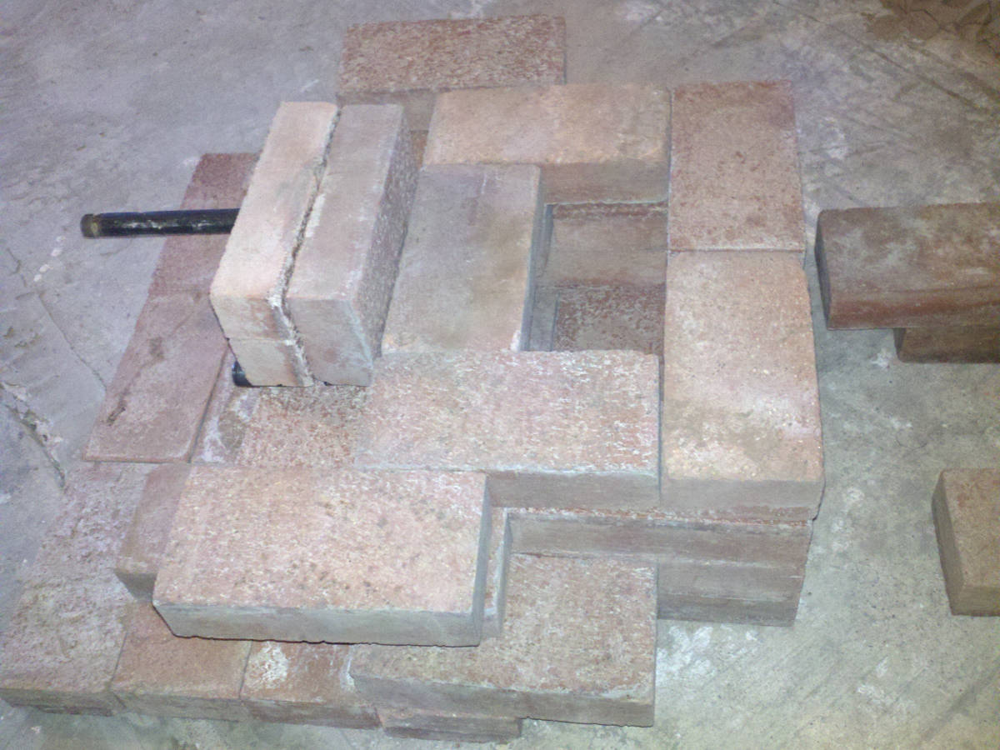
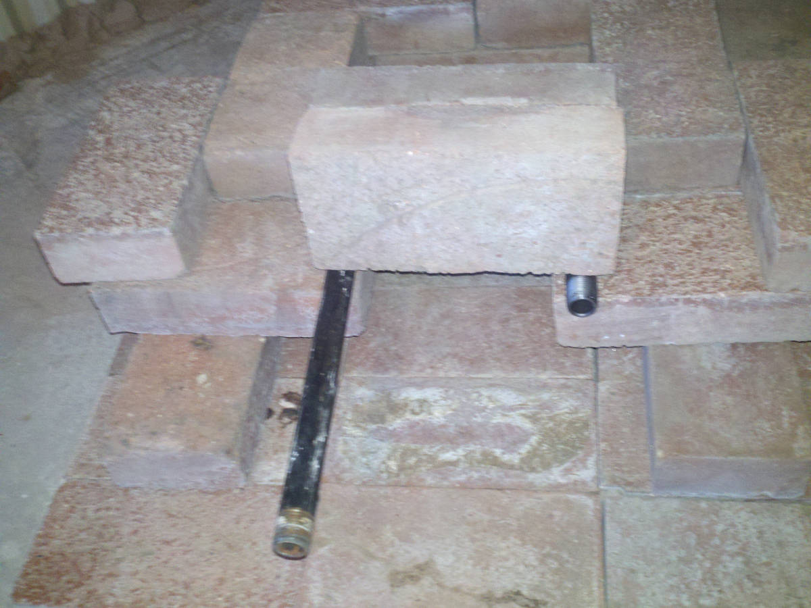
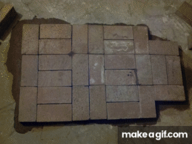
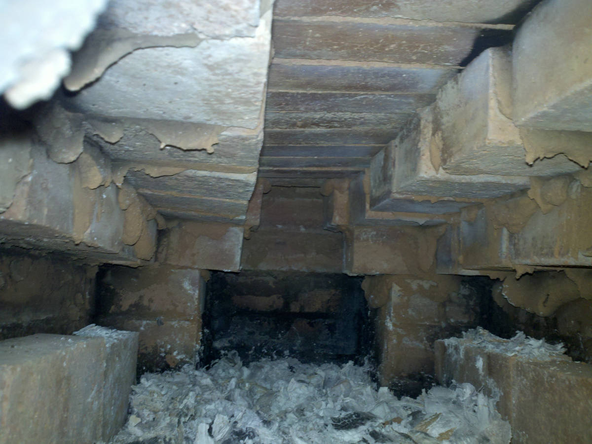

# Brick Rocket Stove

## Overview

It is made with red clay bricks (not fire brick but good enough) and adobe.  

## Previous Iterations

Adobe is not permanent, so that I can overhaul previous designs.

[previous](./README_previous)

I am not going to cover the background.

## Planning

Some planning is done by setting bricks out. It helps get the ideas in my mind.

The propane burner is going to be under the intake slots; the burner will mix fresh air from the intake box so that I can restrict the net airflow into the stove by changing it into the intake box. 

The intake parts remained cool to the touch with the last stove, so I expect they will do so with this setup. I will pour a liquified adobe to the outside of the burner to hold it in place.

## The Build

Link to image of each row of bricks (more or less).

[row0](./Images2/BrickStove2row0.jpg), [row1](./Images2/BrickStove2row1.jpg), [row2](./Images2/BrickStove2row2.jpg),
[row3](./Images2/BrickStove2row3.jpg), [row4](./Images2/BrickStove2row4.jpg), [row5](./Images2/BrickStove2row5.jpg),
[row6](./Images2/BrickStove2row6.jpg), [row7](./Images2/BrickStove2row7.jpg), [row8](./Images2/BrickStove2row8.jpg), 
[row9](./Images2/BrickStove2row9.jpg), [row10](./Images2/BrickStove2row10.jpg), [row11](./Images2/BrickStove2row11.jpg)

## Propane Burner Problem

The propane burner under the air intake burned nicely, but it uses up the oxygen before the wood has a chance, so the test burn with wood looked horrible. I have removed the burner shown in the above images and cleaned up, so the bricks can set over the secondary burn slot like was done on the previous stove. A burn was done to verify that the second burn would work, and it did.

## Firebox Over Sized

Another difference from the previous stove was an oversized firebox, which is about 4 inches (two brick hights) wider. I have set bricks sideways on each side to the firebox to reduce the firebox size. I believe this will return the design to parameters that were working. I removed the propane burner and then decreased the firebox because I wanted the next test to minimize unknowns. 

## Burn Test

It seems to work.

## Exhaust Leaks

The exhaust has positive pressure when it flows out of the heat exchange dome. Unfortunately, the adobe shrinks as it drys, and the cracks leak. I am going to uncover the exhaust runs and coat the channel with adobe in layers to minimize this problem.

Note: the room I am using is on the side of the house; it does not have vents for cooling or heating. Carbon-monoxide levels did not trigger alarms, but I can see the smoke leaking and smell it. If I can sort out the exhaust problems, I can open some windows and use a fan to circulate warm air through the house.

