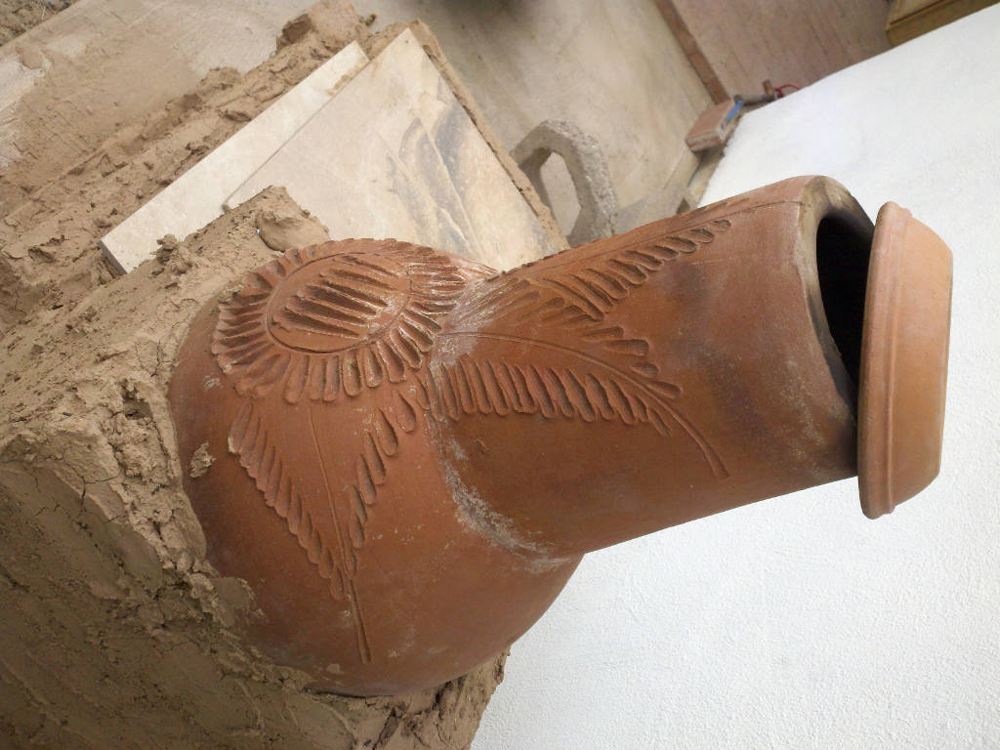
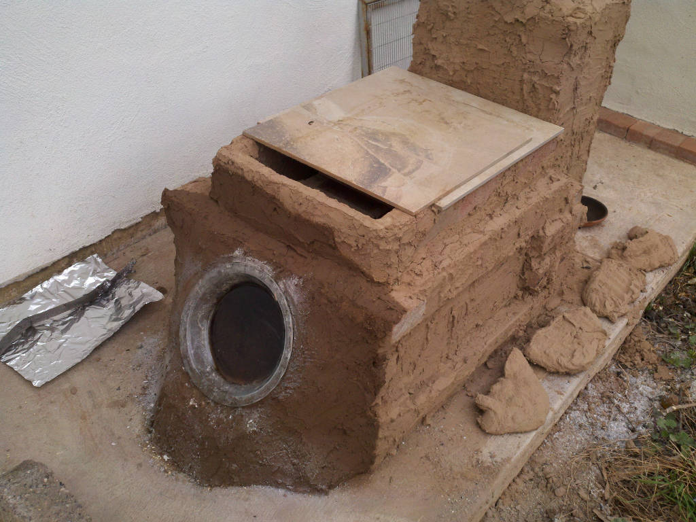

# Brick Rocket Stove

## Overview

I call it a Donkey Stove, it is made with red clay bricks and adobe, which are not fire brick but good enough.  

## Limit Intake Air Flow

After a few experiments of setting up the bricks, it started to become clear that I needed to control the air intake air flow. This image is how the stove looked after the first reasonably controlled burn I had seen. The trick was to use adobe mud to make it somewhat airtight; the aluminum foil cover worked well enough. The images were taken after touching up the intake choke point (the top ceramic tile can move to cut off the air flow.)

For my adobe, I screened the fines from the soil at about 0.5cm (0.2in).

I did not burn enough to see the secondary burn area work; there was smoke (white smoke).

The bricks over the secondary burn area allow small gaps for intake air flow, which cools them. The intake air flow also cools the ceramic tile, they brake when they get hot, I am only using them because they were going to the trash. 

## Damper

What a difference a clean burn made to the secondary burn area.

I had to slow down the burn with a damper since it was sooting. The back pressure revealed holes in the adobe coating. The leaks are critical to prevent since they can have carbon monoxide; this was done outside if that is not obvious.

The soot was from the wood breaking down faster than the available air can oxidize. If I add more air, it will only get hotter, which will accelerate the problem. If I can slow down the burn to the point that the heat loss of the stove is sufficient to restrain the wood from breaking down to fast then clean combustion should be possible.

## Reduce Intake Air Flow More
 
Aluminum Foil works reasonably good, but I want to see what is going on, so trying a Pyrex plate.

Ouch those flames go right up to the glass, will it take it. I have no idea but it is sure mesmerizing to watch.

The damper is no longer needed, and the stove is under negative pressure. The draft is too much when I take the cover off.

The Pyrex Plate exploded after a few dozen cycles; it was violent. I was letting it self-clean by putting aluminum foil over it to allow the carbon deposits to burn off. When I removed the plate from the stove, it cooled to fast and exploded. I guess it is soda-lime glass and not borosilicate.

https://gizmodo.com/the-pyrex-glass-controversy-that-just-wont-die-1833040962

My advice is to use borosilicate if you can find it, and caution is warranted, skip the self-cleaning trick.

## Auto Draft

The draft is the stoves tendency to suck, and the more intake air it does, the hotter the fire becomes the blazing fire means more intake gust. It is a runaway system, but what if there was a way to cause it to self-limit.

The idea is to use an old rusty water heater tank to make an inverted [inverted siphon] (yes that is a double inversion).

[inverted siphon]: https://en.wikipedia.org/wiki/Siphon#Inverted_siphon

First I cut the bottom from an the old rusted hot water heater. Rust actually improves the radiant energy output since it has a high [emissivity].

[emissivity]: https://en.wikipedia.org/wiki/Emissivity

And a few days latter.

The inside of the tank is porcelain over steel.

http://www.ipe-porcelain.com/

The stove pipe will go inside the tank, but it is too short, and the galvanizing is pointless at the temperature it will see, but it's just an experiment, so that is fine. Next is to fit the stove with the galvanized chimney.

After setting the tank over the stove chimney, I have the inverted inverted-siphon.

The tank is set in place; I fired it a few times to see how it works without the the chimney damper. It should now auto dampen (or whatever); the idea is that as the tank temperature gets hot, it will reduce the lift in the chimney and thus dial back the burn rate automatically.

Spot meter said the tank was at ERR temperature; it can report 575degF, so I am calling it 600degF. I am frankly surprised that the galvanized chimney looks as good as it does. I have also found out that putting new wood on hot embers is a bad idea, that was how I got to that peak temperature. The fuelwood breaks down far to fast and dumps soot out the exhaust. Some cycles were done where I pushed the embers to the back before putting the new wood down showed that it could burn from the far end to the front with a peak temperature at the top of the tank of about 525degF. There was almost no soot even with some pine wood. I pushed the embers to the back and put in the pine, and in a few minutes, an inkling of carbon was seen as the pine under the air slots cooked and then it went clean for over an hour at which point the last of the pine gasified into a poof. Watching as that final speck of wood breaks down in front of the Pyrex plate was astonishing, but I was worried the Pyrex was going to shatter.

How much temperature can the Porcelain enamel on the tanks inside take?

http://porcelainenamel.com/504_-_High_Temperature/

## Improved Auto Draft Chimney

What to say.

See what a little rain did to the tank. This retrofit will reduce exhaust height. I will adobe the bricks in place to act as the chimney lining, but I need to get a liner that does not collapse when bumped so I can take the tank off and inspect things.

http://superiorclay.com/fireplace-firebox-design/clay-flue-liners/

Top bricks have unmodified thin set, it will lose most of its strength as it cooks at 600degF, but that is also an experiment (e.g. how strong is it after cooking). The main thing is I can bump the bricks when I lift the tank and not have a total disaster. I also patched some holes and rusted through spots on the tank.

The peak temperature (at the top of the tank) during a burn was 420degF. The peak exhaust temperature was 165degF. The reduced air flow has slowed the fire down. For me, this reinforces the idea that the stove heat loss can be used to keep the burn from producing soot. The tank over the chimney is reducing the draft in a way that has to do with heat differential through the inverted inverted-siphon and does seem to make the burn automatically subdue itself.

The exhaust was cold enough that it looked like steam with ambient about 50degF. As the burn got going and the second bun looked to be starting, I still saw what I thought was smoke, but it was odd how it disappeared as it floated upward. I guess when the exhaust is less than the temperature of condensing water vapor it will look like that, which makes it tricky to tell if the stove is smoking.

I think the stove is automatic enough that I don't need to adjust the intake or the dampener with a microcontroller. But I do want to have a way to start the fire in the far end near the chimney and be notified when it is time to add wood. I have had a few hapless burn cycles when combustion does not get anchored in the back of the stove. 

## Propane

Mix the propane with some air (but not enough to be combustible) and send it into a 1" copper pipe with some holes drilled facing down into the slot between two bricks. The burner pipe is from a broken propane burner. The nozzle is out of view. I think it uses the venturi effect to push the mixture into the stove where a little more air is available to become combustible. Also not visible in the image is aluminum tape used to hold the ends of the brick together, but that may not last long. The mixture is tricky to get right, and this is a total hack. My first attempt resulted in the combustion going back into the venturi area as the stove sucked the fuel mixture from an excessive volume over the burner, it made a fireball in the chimney that caused a draft.

Add more Adoby to limit the damage any leaks can do.

Test 

The 1-inch copper pipe does not have enough volume to make a fireball that drafts enough to cause the problem I was having; lesson learned.

