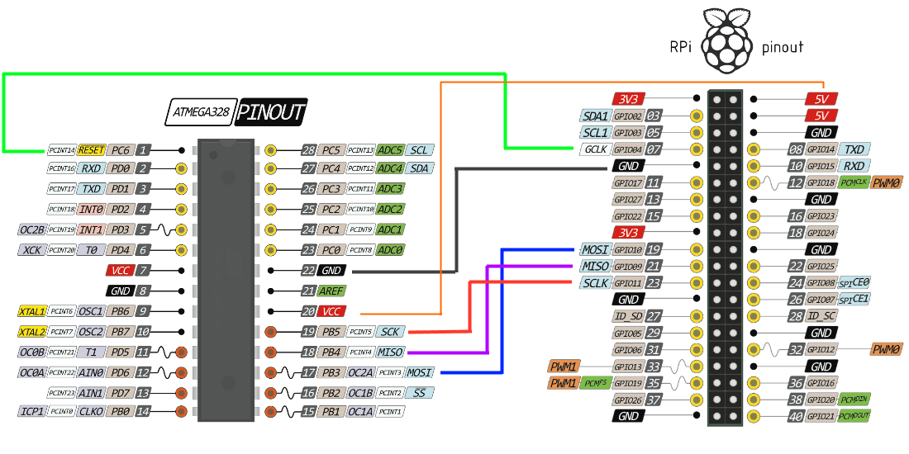

# AVR Cross Compiler

This reference is for a PC with Ubuntu, it is about the AVR toolchain.

AVR MCU's have an open source toolchain that may be used to develop control applications. So that is the focus but first, some quick notes about the Makefile. To build one of the control application run "make". The default build will compile the project and leave a project.hex file. To be used the firmware needs to be uploaded to an MCU control board, which is done with "make bootload". During a bootload, the Makefile goes through the build rules to create the project.hex file and then use a tool (avrdude) to activate the bootloader (e.g. avrdude pulls nDTR/nRTS active to run the bootloader) and then avrdude uploads the binaary image in project.hex using one of the protocols (e.g. xboot uses -c avr109, optiboot uses -c arduino). The serial bootloader operates over the UART (it is not an ICSP connection) and does not erase the upper memory where the bootloader resides (an ICSP tool erases the bootloader). Use "make clean" to remove the project files. 

I use purposefully simple Makefiles, so I can understand them. If a file is added to the project, the Makefile needs updates, it only builds what I've listed, it is not made to be clever. 

[HackaDay-Makefile](http://hackaday.com/2016/03/11/embed-with-elliot-march-makefile-madness/">embed-with-elliot-march-makefile-madness)

The open source GCC based AVR toolchain is time tested and includes gcc-avr, avr-libc, and avrdude. They are used by Atmel Studio and Arduino's IDE. Arduino incurages the use of C++ for learning purposes, but understanding how and when C++ uses heap memory is a strugle and I am in the camp that thinks [object orented programing is bad], so C is my prefered language. I like the Wiring functions (digitalRead, digitalWrite) so I hacked them out of Arduino for use
with C programs. 

[object orented programing is bad]: https://www.youtube.com/watch?v=QM1iUe6IofM

One advantage of using a Makefile is the ability to run it over a command line interface (CLI). This allows placing the source on a remote machine near the physical computing application and building the firmware at that location over a remote SSH connection, or doing the same on site when the Internet connection is down. The files can be edited and pulled or pushed by Git and Mercurial when the internet is working. Sometimes I use Samba to share files so I can work on them from a Windows computer. 
    
I have found that a headless Raspberry Pi Zero has just enough of a Linux system on it to build my projects and it can be located at the Internet edge. It allows me to do most of the work at my home in the city where I have internet access and then take everything out to a remote location and make some updates without worries about the toolchain on a seldom used laptop.


## SSH notes

```
    # see https://help.ubuntu.com/community/SSH/OpenSSH/Configuring
    # openssh-client  is normaly installed by default
    sudo apt-get install openssh-server

    # backup config
    sudo cp /etc/ssh/sshd_config /etc/ssh/sshd_config.factory-defaults
    sudo chmod a-w /etc/ssh/sshd_config.factory-defaults

    # edit config (if needed)
    sudo gedit /etc/ssh/sshd_config

    # restart
    sudo service ssh restart

    # "sudo /etc/init.d/ssh status" is replaced see man service
    service ssh status


    # lost public key but still haver private
    ssh-keygen -y -f ~/.ssh/id_dsa > ~/.ssh/id_dsa.pub
    ssh-keygen -y -f ~/.ssh/id_rsa > ~/.ssh/id_rsa.pub

    # mkeys is my bash script used to install keys from one server to another
    # doing so allows connections without passwords 
    # copy mkeys to ~/bin or some place 
    ./bin/mkeys localhost
    
    # test and notice a password was not needed
    ssh localhost

    My little mkeys script...

    # It will make (if missing) keys and then copy the public key into the remote box. 
    [mkdir bin] 
    cd bin
    wget https://raw.githubusercontent.com/epccs/Document/master/DvlpNotes/script/mkeys
    chmod u+x mkeys
    # note if you have a private key you want to use place it in .ssh now
    ~/bin/mkeys localhost
    # that should have setup the keys so try to log in
    ssh localhost
    # if that works one of the putty tools can convert the private key for use with putty on Windows.
    # mkeys can place the public keys on other Linux machines, raspberrypi is a Pi Zero
    # and zeroconf seems to work (try with a ping first).
    ~/bin/mkeys raspberrypi.local
    ssh raspberrypi.local
```

Samba

[https://help.ubuntu.com/community/Samba](https://help.ubuntu.com/community/Samba)

also read this

[How to Create a Network Share Via Samba Via CLI](https://help.ubuntu.com/community/How to Create a Network Share Via Samba Via CLI (Command-line interface/Linux Terminal) - Uncomplicated, Simple and Brief Way!)

```
    sudo apt-get update
    # well hell I messed it up.
    sudo apt-get remove --purge samba cifs-utils samba-common
    sudo apt-get install samba cifs-utils samba-common
     #   note smbfs has been removed from Linux due to security and ilk

    # backup config
    sudo cp /etc/samba/smb.conf /etc/samba/smb.conf.factory-defaults

    # When Lubuntu was installed I made a user rsutherland
    # Set passwd for your user in Samba:
    sudo smbpasswd -a rsutherland

    #Folder to share
    mkdir /home/rsutherland/Samba

    sudo gedit /etc/samba/smb.conf
        #===== Global Settings ==========
        workgroup = WORKGROUP

        # add this to the very end of the file
        [Samba]
        path = /home/rsutherland/Samba
        valid users = rsutherland
        read only = no

    sudo service smbd restart

    Check for errors
    testparm

    # so now my user name (rsutherland) on Windows can map 
    # to the share on Ubuntu 16.04 (computer name is conversion)
    \\conversion\Samba
```


## Setting up Git

[https://help.github.com/articles/set-up-git/](https://help.github.com/articles/set-up-git/)

```
sudo apt-get install git
```


## AVR toolchain

Now the easy part

```
sudo apt-get install gcc-avr binutils-avr gdb-avr avr-libc avrdude
git clone https://github.com/epccs/Irrigate7
cd Irrigate7/BlinkLED
make
```

* [gcc-avr](http://packages.ubuntu.com/search?keywords=gcc-avr)
* [binutils-avr](http://packages.ubuntu.com/search?keywords=binutils-avr)
* [gdb-avr](http://packages.ubuntu.com/search?keywords=gdb-avr)
* [avr-libc](http://packages.ubuntu.com/search?keywords=avr-libc)
* [avrdude](http://packages.ubuntu.com/search?keywords=avrdude)

Yep, that is ridiculous, now the controller programs can be compiled from C source files. 

An Editor is helpful to modify the program, use one that does the Makefile tab characters,which are in front of the [rules] and do not have trailing spaces after. 

[rules]: https://en.wikipedia.org/wiki/Make_(software)#Rules

On Windows I use SciTE with these settings in SciTEUser.properties

```
        tabbar.multiline=1
        toolbar.visible=1

        statusbar.visible=1

        # use space indentation for everything, but the makefile magic bellow
        tabsize=4
        indent.size=4
        use.tabs=0

        statusbar.number=1
        statusbar.text.1=\
        $(FilePath) li=$(LineNumber) co=$(ColumnNumber) $(OverType) ($(EOLMode)) $(FileAttr)

        # makefile indentation magic
        indent.size.$(file.patterns.make)=4
        tab.size.$(file.patterns.make)=4
        use.tabs.$(file.patterns.make)=1
```
    
Linux has many editor options that work: Vim, Emacs, Geany, gedit, ... SciTE is not even a good option. Unfortunately, Linux is on the old or headless computer and I need to reference drawings and other documents so SciTE is what I mostly use. (Note I should try the [Atom] editor at some point).

[Atom]: https://github.com/atom/atom


## Pi as a ICSP tool for AVR



```
    sudo nano /etc/avrdude.conf
```

Search with nano's Where option for "linuxgpio" and uncomment e.g.

```
        programmer
              id    = "linuxgpio";
              desc  = "Use the Linux sysfs interface to bitbang GPIO lines";
              type  = "linuxgpio";
              reset = 4;
              sck   = 11;
              mosi  = 10;
              miso  = 9;
```

Welp, avrdude -c ? (version 6.1 on jessie) did not show the linuxgpio type, but it does show linuxspi.
    
```
        programmer
            id = "linuxspi";
            desc = "Use Linux SPI device in /dev/spidev*";
            type = "linuxspi";
            reset = 25;
```

to use linuxspi un-blacklist the spi-bcm2708 module [raspberrypi SPI].

[raspberrypi SPI]: https://www.raspberrypi.org/documentation/hardware/raspberrypi/spi/README.md

