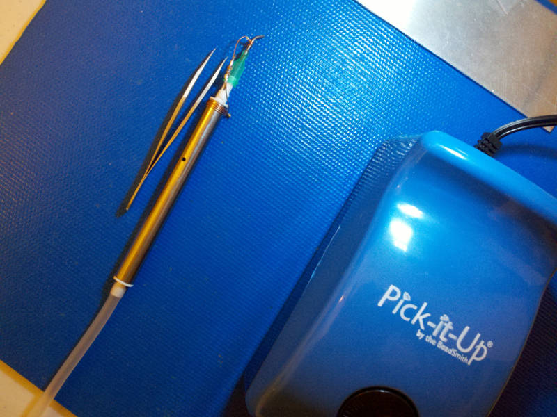
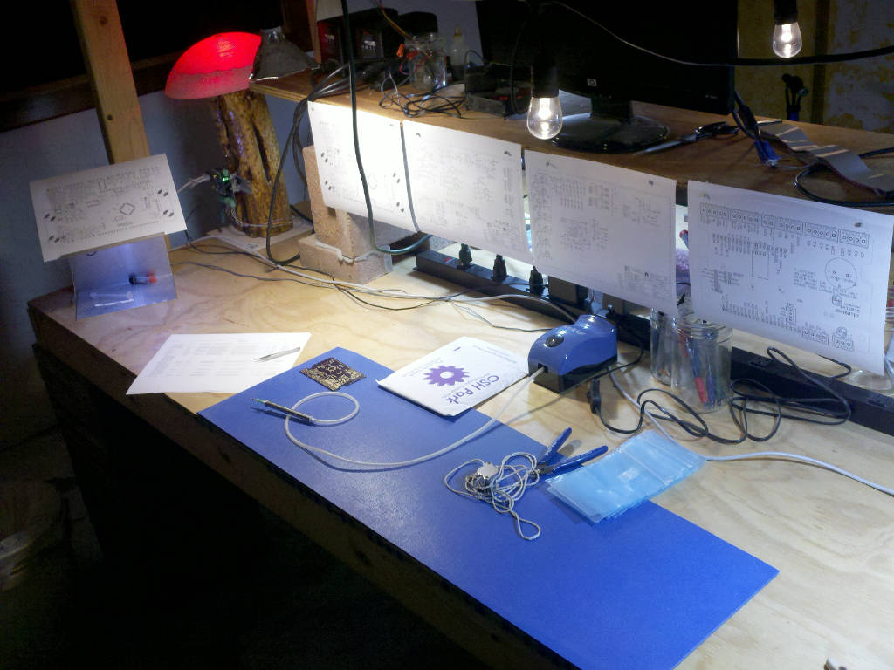
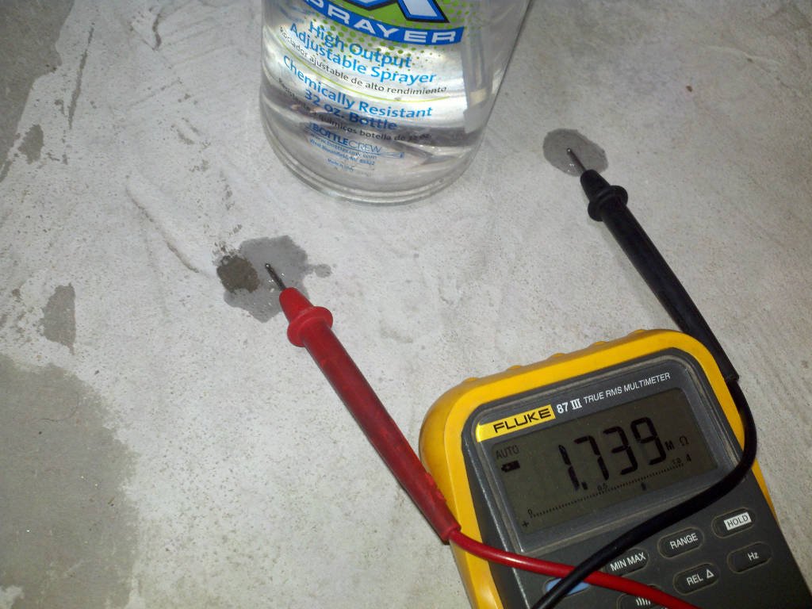

# ESD Safe Work Area

## Overview

When an Electro Static Discharge (ESD) Safe work area is required.

## ESD protected

A wrist strap must be worn while handling ESD sensitive parts. The wrist strap must be connected to the "Work Area Common" point, and include an in-line safety resistance (e.g. 1 to 10Meg Ohm). Optionally an ankle strap may be worn while handling ESD sensitive parts. An ankle strap will only work if the floor is a dissipative surface with a simular in-line safety resistance.

An electrically dissipative surface needs to be installed on work surfaces where ESD sensitive parts will be handled or placed. All electrically dissipative surfaces are to be connected to the "Work Area Common" point. The surface resistance should be checked after maintenance or cleaning.

## Work Area Common

The work area common point is an electrical node, it provides the same electrostatic potential to all connections. Do not tie this directly to earth ground instead us a connection through a 1 to 10Meg Ohm resistor, which improves safety and does not harm ESD protective quality.

## Vacume Pick Up
 
The tip of a vacuum nozzle is metal or conductive material, don't use a rubber or plastic tip because it will not remove the charge from the part after the triboelectric effect occurs. The metal nozzle should be connected to the "Work Area Common." The handpiece is in contact with the operator's hand which is connected through a wrist strap, but if a glove is worn things become complicated (I have not found a glove that is reliably dissipative).

For manual pick and place, I have a floor that is bare cement and wood surfaces that are unfinished; both are dissipative although the wood is higher than 10MegOhm. Triboelectric charging can build up from walking or moving if it is not dissipated. The top of the vacuum pick up tool has a 1 Meg Ohm resistor between the pickup needle and the tool handle with which I am in contact. Paper is dissipative, but it is also moved around, it needs to be set where it can be seen and not transferred. I like to mark on the BOM as I populate the board, and that is an ESD problem area I need to fix. It is essential that anyone assembling electronics understand these issues.

https://en.wikipedia.org/wiki/Triboelectric_effect

## Electro Static Discharge (ESD)

Everything around, including people, have an Electro Static Potential (ESP) which changes with movement or contact with anything/anyone. When contact occurs the ESP will equalize as a function of contact resistance, which is an ESD event. The goal of ESD control is to limit the severity and rate of an ESD event. The human body has electrical conductivity; it will equalize electrostatic potentials a little to fast, which is not helpful when dealing with ESD sensitive parts. If an ESD sensitive part is contacted by something at a different ESP, the rate at which the potentials equalize will determine the level of damage. It's safest if the ESP difference is small and the pace of equalizing is slow.

A wrist strap is designed to keep a person safely at the same ESP as the "Work Area Common," however, this is not a perfect solution. ESP will change quickly due to movement or contact and will take a few seconds to equalize through the ground strap resistor. For example, if someone or something contacts the person while they are reworking an ESD sensitive part, it is possible for the piece to have experienced a severe ESD event.

A low ohmic contact with the "Work Area Common," (e.g. the case of a computer) can result in a damaging ESD event to anything with an ESP level different than the common. I tend to wait a few seconds before removing parts from ESD bags after placing the bag on the dissipative surface so the parts ESP has time to equalize. 

## WARNING

Do not have anything you work on powered or plugged in. A disipatice path is a conductive path and current flow can kill.

## Testing

Electrically dissipative surfaces are available from several vendors. Unfinished wood and concrete may also be acceptable dissipative surfaces when the relative humidity is between 30% and 70%.

Anti-static (sometimes pink color) is not dissipative you can check this with an ohmmeter. Dissipative placemats should read with a good ohm meter, however sometimes a puddle of water is needed to make the ohmic contact, a spray bottle used for cleaning can drip a few spots for use as ohmic contacts to test between (not within a puddle but between them).

