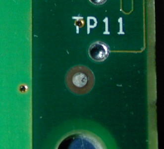
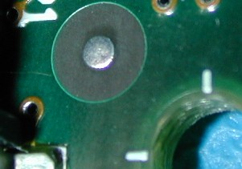
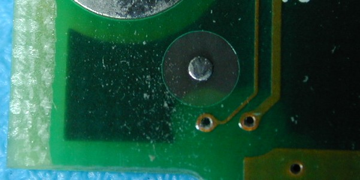
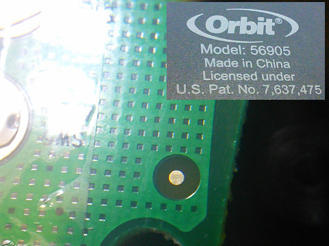
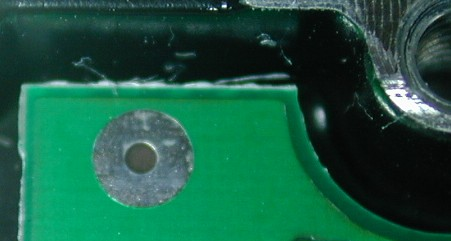
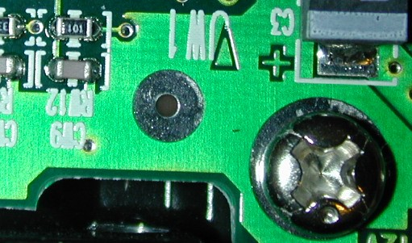
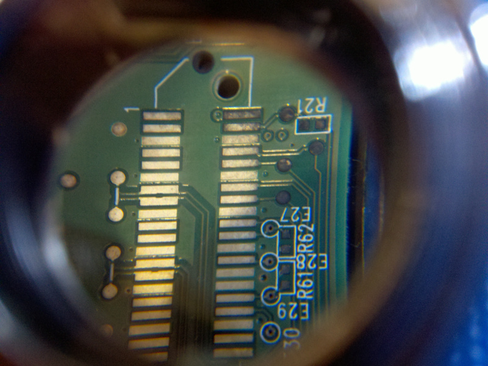
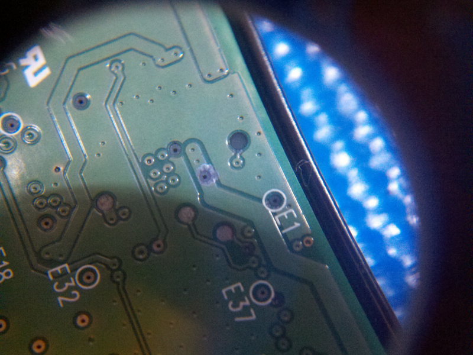
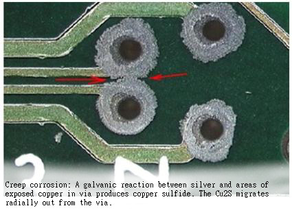

# Printed Circuit Board Techniques

## Overview

Some board techniques to know about, like Fiducials, Immersion Tin, Immersion Silver.

## Fiducials

Many manufacturing automation systems use alignment marks called "Fiducials" to define a coordinate system on a surface. In the electronics industry the marks diameter is often in the range 0.020-0.030in, with at least twice the marks diameter clear of any visual noise. To define a coordinate system for a surface two marks are required, usually at extreme ends of a board.

A bad one found on a Voodoo5 board form 3DFX.

A good one found on a NIC board form Intel.

But the same Intel board has a poor fiducial with visual noise from an inside layer.

On a irrigation board from Orbit.

There are some odd ways to do this, like found on a hard drive form Samsung.

## Immersion Tin or Silver Pads

Is this Tin Pest or Tarnish on Immersion Sn/Ag pads of a Western Digital HD after a year of operation.

Same board with creep corrosion which needs silver and exposed copper.

New Immersion pads look clean and bright (this is same type of drive, but new).

Creep corrosion is a galvanic reaction between silver and exposed copper that causes tarnish (Ag2S) to become copper sulfide (Cu2S) and then migrate. It is conductive thus will short circuit nodes.

## Tin Pest

The transformation of bright (beta) tin into grey (alpha) tin is well known, it is prevented by alloys (e.g. lead is the best known.) As the phase change moves under an IC pad it will lift,separate, and open the electrical connection. Bright tin on a pad can drive a phase change into an interface so it is important to have a protective metallurgic alloy between the pad and part.  

https://www.youtube.com/embed/sXB83Heh3_c

These problems have been known for some time (pest for centuries), but are slow process, just barely technical enough to get past the average bullshit detector. They act as a built-in failure mechanism that will force me to buy another after a few years (or less).

What happens to lead in the land-fill? My research suggests that it turns into lead sulfide or Galena as it goes through various inorganic and organic (microbes) reactions. I don't find much that indicates it can leech out. Lead is plenty bad in many of the ways it has been used (e.g., Avgas for example) but I suspect its quickly imbraced removal from solder has less to do with being hazardous.
