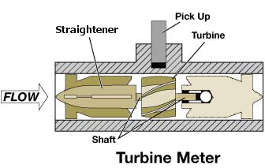
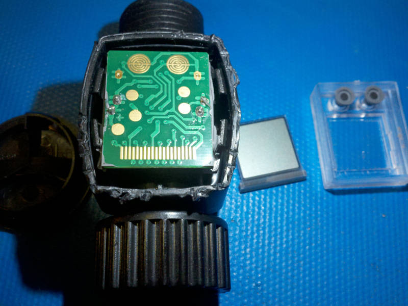
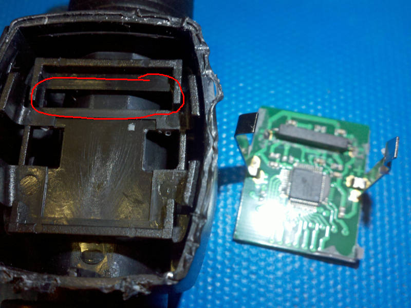
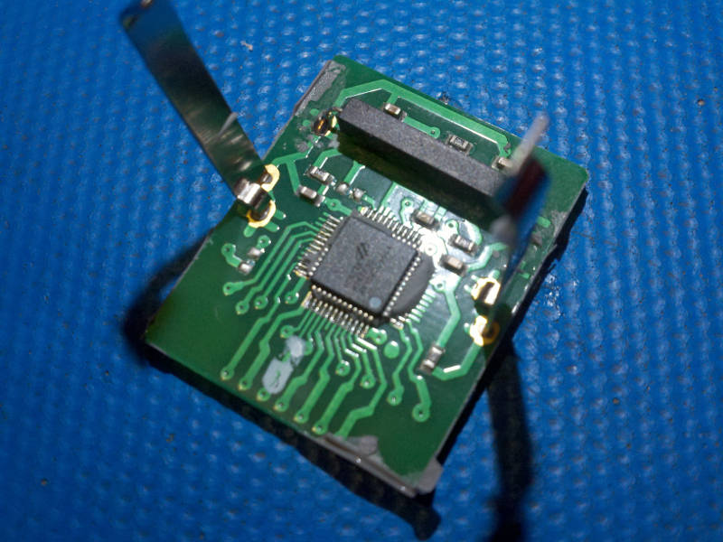
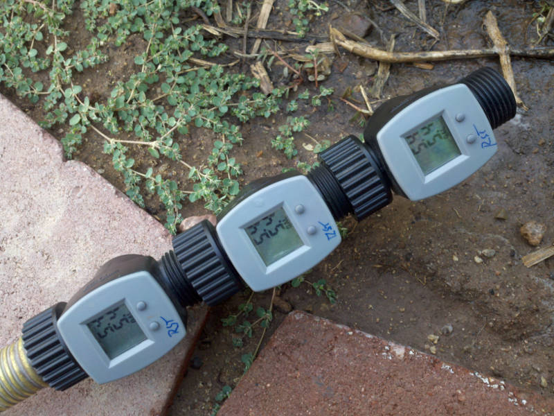
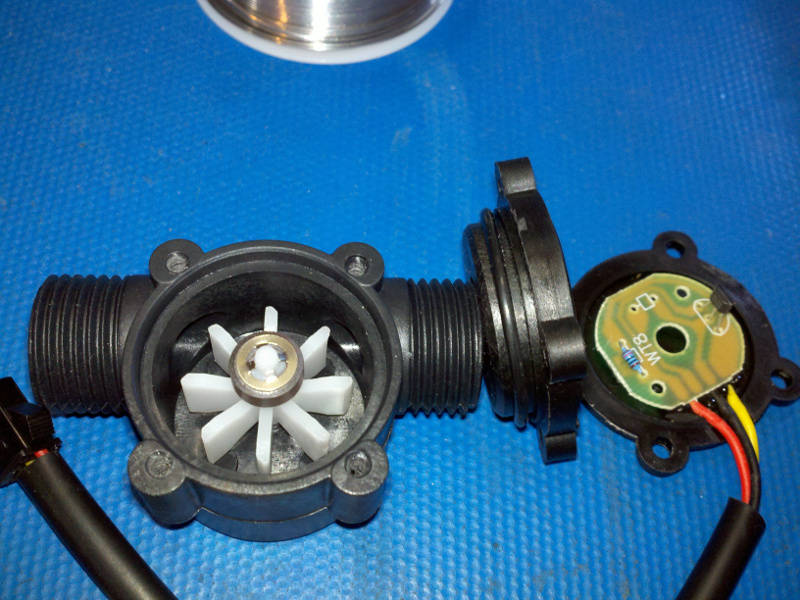
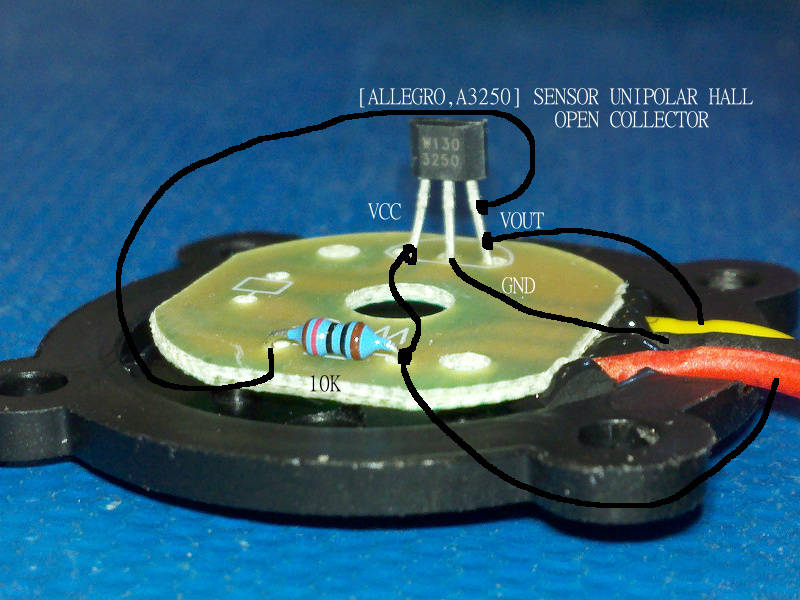
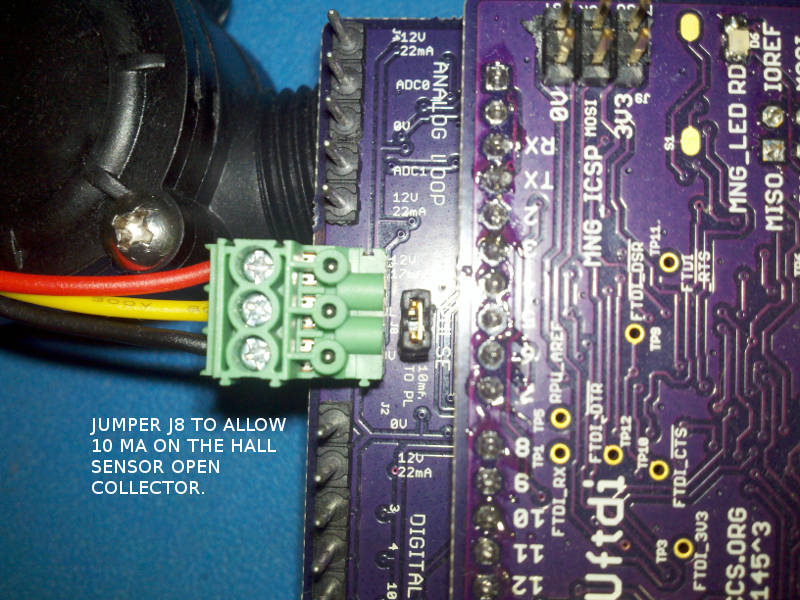

# Flow Meter

## Overview

The Flow Meters that I use make a pulse ouput that is a function of flow rate.

## Turbine Flow Meter

Turbine flow meters are widely available.

I have been using an [Adafruit_833] for many years now, and it works but I struggle with it leaking (it has BSPP threads on the output, not a good idea). It has a hall sensor which makes a debounce free signal edge, but the event is not a true position like variable reluctance meters.

[Adafruit_833]: https://www.adafruit.com/product/833

I have just (8/2/17) got an [Orbit_52212] from one of the hardware stores that distribute Orbit stuff, it has the correct threads for my irrigation projects (yay), the electronics will need some overhaul (which I have not yet finished). I paid 10$ for it, and that seems like a good price since the turbine spins with low mechanical resistance. 

[Orbit_52212]: http://www.homedepot.com/p/Orbit-Water-Flow-Meter-52212/205489792

Orbit 52212 broken open, the cover was cut into little pieces, but all I needed to do was push in the tabs that are accessible from the battery cover side to open the display side (it is not lost, my plan is to hot glue mount a hall sensor).  

The Orbit 52212 has a Magnetic Reed Switch which is common in low-cost flow meters. The reed switch fits in a slot in the mounting bracket in which the board has been covered with silicone to hold it in place (likely needed for measurement repeatability). The reed uses almost no battery power so it makes sense for a battery powered application like this (it may add some flow drag). The replacement hall sensor will need to be hot glue mount near where the slot is. The turbine is coupled to a magnet at that location, which I verified with another magnet. The hall sensor can be nearly as accurate as a variable reluctance sensor as long as there is no time varying magnetic sources nearby (e.g. AC solenoids, AC motors...), latching solenoids should not impair accurate hall sensor measurements. 

The Orbit 52212 has a Holtek HT67F30 MCU. This seems adequate for the task it is doing, but my application needs an open collector (e.g. a pull down) type sensor that makes pulses as a function of flow rate. 

The Hall sensor that I will try is an [Allegro_A1190LUBTN], it has a current source built in that switches between 2-5mA and 12-17mA, which should work directly with the 100 Ohm twisted pair termination I have on RPUno and Irrigate7 (which bias an NPN open collector pull down for the input capture pin). It can, therefore, be wired with a CAT5 twisted pair, which is noise immune and easy to find. Also, the [K3] board is using 3 of 4 CAT5 pairs so one can be used for the flow meter (and [Irrigate7] is using 7 of 8 pairs of two CAT5 lines). 

[Allegro_A1190LUBTN]: https://www.digikey.com/product-detail/en/allegro-microsystems-llc/A1190LUBTN-T/620-1812-1-ND/6174509
[K3]: https://github.com/epccs/Driver/tree/master/K3
[Irrigate7]: https://github.com/epccs/Irrigate7

Running three in a row shows good resusts after the flow stops. While they were running the numbers did not match which I think has to do with showing data on an LCD.

## Paddle Wheel Flow Meter

I have some [Adafruit_828] which seem to work. Note, they are small. The hall sensor makes a nice debounce free signal edge. The pull up is 10k Ohm so I need to add a 10mA current source to have enough pulse current for my projects.

[Adafruit_828]: https://www.adafruit.com/product/828

Adafruit 828 tear down.

Adafruit 828 Hall Sensor with 10k Pull Up.

Adafruit 828 On RPUno with 10mA current source added to the 10k Ohm pull up.

