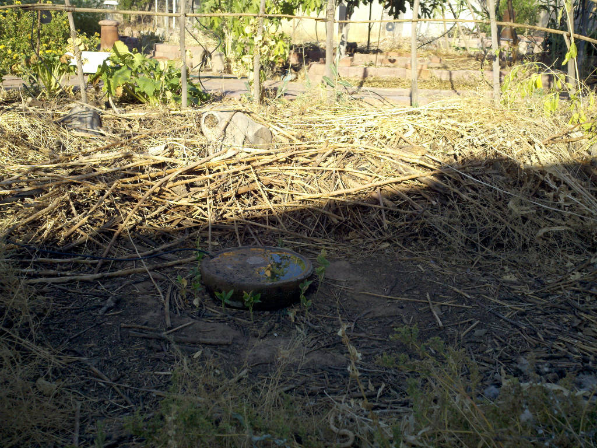

# Garden

## Overview

Why? It is how I get a little fresh whole food every day. 


## South by South-West Area

This is the south by south-west facing side of the house. It's not easy to tell but there is a water catch behind the raised bed that faces the walkway. The bean poles keep the HDPE irrigation tubing suspended over them. At the time of this image, the enclosure has an RPUno^5 with K3^1, which I've decided is working well enough to start testing. K1 is connected to a short run of tubing over the new work (ashes are from a fire last night). K2 is to the tubing to the left and farther back. K3 is doing the orange tree and grape vines along the property wall.


I have added emitters now. This image shows where the squash will be. It had some seeds I had saved and grew as a sort of cover crop, which is still growing just around the corner. 


After doing the emitters, I was thinking about how I wanted the drip to work. To change the settings I send commands to the solenoid firmware over its serial port. In this case, I have an RPUftdi^3 on my test bench at address '0' and the RPUno^5 on which I want to change settings has an RPUadpt^4 at address '1'.

The solenoid firmware has several commands that will change the settings. There is the expected runtime, which does what is expected; it is how long the solenoid will be actuated.

```
/1/runtime 1,300
{"K1":{"runtime_sec":"300"}}
/1/runtime 2,300
{"K2":{"runtime_sec":"300"}}
/1/runtime 3,300
{"K3":{"runtime_sec":"300"}}
```

There is also a delay time which is only used when more than one cycle is run. It tells how long to delay between cycles. I want the next period to start in an hour, so I need to subtract the runtime from 3600 (oops I had that screwed up until I wrote this).

```
/1/delay 1,3300
{"K1":{"delay_sec":"3300"}}
/1/delay 2,3300
{"K2":{"delay_sec":"3300"}}
/1/delay 3,3300
{"K3":{"delay_sec":"3300"}}
```

A pre-delay can be used to separate the solenoid operating times, so they are out of phase. For example, I will give K1 the first ten minutes of each hour and give K2 the next ten minutes, and so on. 

```
/1/pre 3,1200
{"K3":{"delay_start_sec":"1200"}}
/1/pre 2,600
{"K2":{"delay_start_sec":"600"}}
/1/pre 1,1
{"K1":{"delay_start_sec":"1"}}
```

Once values have been set, I can pick how many cycles to run and save the settings to EEPROM. 

```
/1/save 1,10
{"K1":{"delay_start_sec":"1","runtime_sec":"300","delay_sec":"3300","cycles":"10"}}
/1/save 2,10
{"K2":{"delay_start_sec":"600","runtime_sec":"300","delay_sec":"3300","cycles":"10"}}
/1/save 3,10
{"K3":{"delay_start_sec":"1200","runtime_sec":"300","delay_sec":"3300","cycles":"10"}}
```

After the day-night state machine finishes its morning debounce the solenoid state machine values are loaded from EEPROM, and it starts to cycle. The result is that for the next ten hours each valve is actuated for 5 minutes at each hour.

I checked the flow and time at about noon and see that it has five more cycles to do.

```
/1/flow? 1
{"K1":{"cycle_state":"11","cycles":"5","flow_cnt":"8567"}}
/1/time? 1
{"K1":{"cycle_state":"11","cycles":"5","cycle_millis":"1500000"}}
/1/flow? 2
{"K2":{"cycle_state":"11","cycles":"5","flow_cnt":"32794"}}
/1/time? 2
{"K2":{"cycle_state":"11","cycles":"5","cycle_millis":"1500000"}}
/1/flow? 3
{"K3":{"cycle_state":"11","cycles":"5","flow_cnt":"63485"}}
/1/time? 3
{"K3":{"cycle_state":"11","cycles":"5","cycle_millis":"1500000"}}
```

The flow count is a pulse from the flow meter, which is about 3ml in this case. The flow in K1 is 8567 x 3ml or 25.7 liters. The 3ml is approximate; it needs to be calibrated to see what the flow meter K factor is (a future project perhaps).

More squash added under solenoid K2.


Added four (16L/hr) emitters to the solenoid K2 line, and remove nine (16L/hr) from the solenoid K3 line (orange tree). After running for a day.

```
/1/flow? 3
{"K3":{"cycle_state":"0","cycles":"0","flow_cnt":"89842"}}
```

The solenoid K3 line has used 71 Gallons (3mL per each of the 89842 flow counts), so I reduced the run time by half (for everything).

```
/1/load 1
{"K1":{"delay_start_sec":"1","runtime_sec":"300","delay_sec":"3300","cycles":"10"}}
/1/delay 1,3450
{"K1":{"delay_sec":"3450"}}
/1/runtime 1,150
{"K1":{"runtime_sec":"150"}}
/1/save 1,10
{"K1":{"delay_start_sec":"1","runtime_sec":"150","delay_sec":"3450","cycles":"10"}}
/1/load 2
{"K2":{"delay_start_sec":"600","runtime_sec":"300","delay_sec":"3300","cycles":"10"}}
/1/delay 2,3450
{"K2":{"delay_sec":"3450"}}
/1/runtime 2,150
```

Cardinals are such cool birds, they dig and spread the mulch around so nicely. Unfortunately, they nip the seedlings and it is a significant setback. I put the cover on too late to stop them which is more or less standard procedure, they are so good natured and fun to watch, and then they clip the squash. 


The Enclosure has an updated RPUadpt^4 with the bus manager clocking from a 12MHz crystal. That allows the DTR pair to run at its full maximum speed of 250kBit/sec; the transceivers are slew rate limited, so they don't hit the power supply hard or make strong EM emissions.

The other parts are still an RPUno^5 (with a hack to measure raw PV voltage) and K3^1 board (with hacks to make it work). K3^2 board is cooling in the oven at the time of this image.

https://github.com/epccs/Driver/tree/master/K3


Got past the bird problem, but


It got hot to fast, it is 107 degF the day of image and the plants are stressing. 



That image is just after it had got to 121 degF and shows a little water for the birds; it fills every hour and seeps through the dirt in the planter in a few hours. In theory, it should not cause a mosquito problem. 


