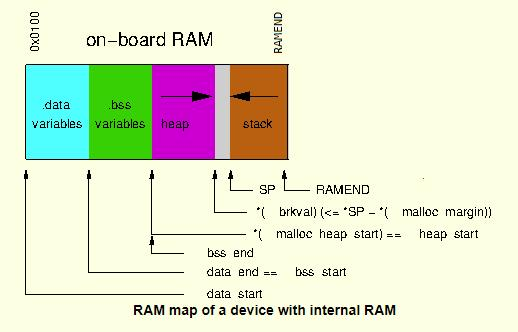
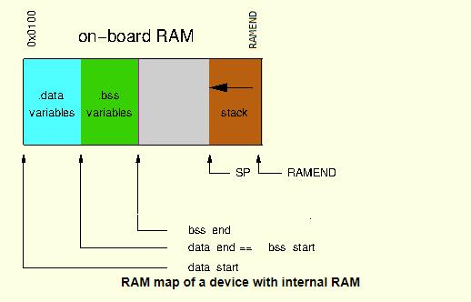

# Heap and Stack on AVR

## Overview

This page involves memory systems; I revisit this every so often because I live in a world where some ideas that sell well don't live up to there hype.

Which compiler are you talking about, since there are different strategies? If it happens to be GCC for AVR, then the user manual is pretty clear about the layout.

https://www.nongnu.org/avr-libc/user-manual/malloc.html

That is a very informative read; I had no idea that external ram could be used like that.

## Most AVR lack external RAM

The generalized view of memory looks like this:

The heap and stack can collide if there are sufficient requirements for either dynamic memory system. The former can even happen if the allocations aren't all that large, but dynamic memory allocations get fragmented over time such that new requests don't quite fit into the "holes" of previously freed regions. Large stack space requirements can arise when functions contain large and/or numerous local variables or when recursively calling. Almost no AVR application is mad enough to use the heap (e.g., malloc() and free() ) so the generalized memory use should look like this:

That is basically how the majority of reliable avr-gcc applications with AVR work.

Globals (e.g., static memory) are positioned at fixed locations in .data and .bss and are placed side-by-side from the start of RAM. The stack is used to preserve registers from ISR's and CALL/RET (e.g., function calls) addresses as well as automatic locals used by the function. All are created on the stack that works its way down from RAMEND downwards (or in the picture leftwards).

Heap needlessly obfuscates how much memory is in use. The compiler can report static memory usage but not dynamic memory usage.  

Partly lifted from this thread:

https://www.avrfreaks.net/forum/what-part-microcontroller-controls-stack-and-heap

## C++

C++ uses the heap, and that is a fact. 

What about automatic garbage collection, doesn't C++ do that? No, it does not. You can write an application that will malloc a block of memory and then garbage collect within that block, but that is a task for the developer. The problem is the features in C++ will allocate outside your garbage collection region. I have come to view the stack as an ideal way to collect garbage; it maintains the free memory as continuous addresses.

So the question I now ask is if you know C++ well enough to avoid using the heap. I do not. I have been told by a few that for them it is perfectly fine. All I can say is that if I can't figure out how to rewrite their perfectly fine library in C, then I walk elsewhere. I have been burned by heap and stack memory corruption enough to know that using C++ is inviting disaster into my project. At some point, I will start looking into how GCC does its heap and stack memory systems on ARM, though at this point I am wagering that the C++ mind virus is just as infectious and sickening as it is on an AVR.

Is it a good idea to teach C++, I think C is simpler to learn so I don't understand the need to teach C++ on AVR (or ARM). I think the Raspberry Pi is an excellent place to learn C++, but they seem to show a lot C (and I support doing that BTW). Somehow the way ideas have played created an upside-down system for learning about computer programing. If I were looking for a gift to give a crafty nephew, it would be an R-Pi, but I worry that it is too powerful. 

# Links

* [Mastering stack and heap for system reliability: Part 1 – Calculating stack size - Embedded.com](https://www.embedded.com/mastering-stack-and-heap-for-system-reliability-part-1-calculating-stack-size/)
* [How to Prevent and Detect Stack Overflow | Barr Group](https://barrgroup.com/Embedded-Systems/How-To/Prevent-Detect-Stack-Overflow)
* [On Stacks - The Embedded Muse 309](http://www.ganssle.com/tem/tem309.html#article3)
* [GNATstack - Adacore](https://www.adacore.com/gnatpro/toolsuite/gnatstack)
* [AVR | 7. Machine Specific Topics — GNATstack 20.0w documentation](http://docs.adacore.com/live/wave/gnatstack/html/gnatstack_ug/Machine_Specific_Topics.html#avr)
* [Other stack-usage analysis tools](http://www.bound-t.com/stack-usage-tools.html)
* [Are We Shooting Ourselves in the Foot with Stack Overflow? « State Space](https://embeddedgurus.com/state-space/2014/02/are-we-shooting-ourselves-in-the-foot-with-stack-overflow/)
* [Hardware Features | The Embeddded Muse 231](http://www.ganssle.com/tem/tem231.html#article2) though AVR doesn't have the built-in stack overflow detection capability of PIC24 and dsPIC, some AVR OCD have enough data address comparators to detect stack overflow :
* [Atmel Studio 7 - Stack Overflow Detection Using Data Breakpoint](https://www.microchip.com/webdoc/GUID-ECD8A826-B1DA-44FC-BE0B-5A53418A47BD/index.html?GUID-A4FC8DB5-6B28-4893-93BA-7A4406698E5D)

https://www.avrfreaks.net/forum/stack-managment