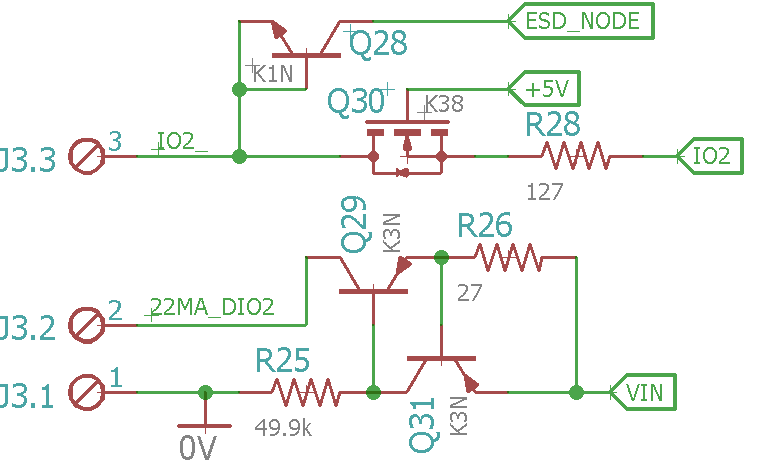

# Intrinsically Reliable

## Overview

To go beyond ruggedized, I use current sources that have the intrinsic property (essential to the control board) that they can not damage an MCU pin on the board. 

Note: Intrinsically Safe means that a circuit node is unable to cause ignition of a flammable atmosphere, so that is a different concept.

## BSS138 Level Shift

Level shift protection is a way to ruggedize a control board, and I think it is good for general purpose digital and analog interfaces.

I noticed some circuits that level shifted I2C with a BSS138 (K38), though I did not understand what was going on, so I simulated with SPICE until I started to understand. The short and incomplete view is that it blocks voltage levels that are above what would cause the FET's source voltage to force the gate into "pinch-off." 

https://en.wikipedia.org/wiki/MOSFET

It has an ESD risk if there is not a way to bypass the discharge. 

## Current Source

The current source is aimed to be about 22mA but may range from 21 to 23mA. The MMBT3906 (K3N) is the PNP transistor that I am using. Most of the heat is dissipated by the output collector of one acting as the current source, but it is not the one that senses the current flow. So there are two options, one is to deliver a constant current no matter the heat, and the other is to thermally couple the transistors and allow the sensor to fold back as the temperature increases. I like the fold back option because it extends the safe operating area range, so that is how I typically set up the circuit board layout.

Providing current sources on the microcontroller board that are less than the current that can harm the MCU pins has saved me. In the past, I relied on fuses to protect my current loops, but those are one-time use and expensive, and the wrong values kept showing up in places they should not. A larger transistor package would allow more current, but the SOT23 seems to be a good fit for 22mA at the voltages I use (12V, 15V, 24V, and 30V). Within a working current loop, the voltage will drop at the sensor, so the current source does not fold back, e.g., the sensor controls the 4-20mA range.

If the current loop sensor fails and the current source drops all the voltage it will fold back and supply less current. The lower current depends on the voltage drop, but with a 12V power input (and higher) the fold back should be to a value less than 20mA, which the ESD diodes of the MCU pin can tolerate. As a result, the level shift seems to be redundant when using the current source to energize a loop. Another situation is if the loop sense resistor becomes disconnected, then the loop sensor will control the current through the MCU pin ESD diode, which it should again tolerate.  

Note that I have been considering AVR Mega MCU's others have different current and voltage limitations, and the level shift is more clearly needed with them.