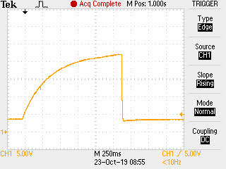
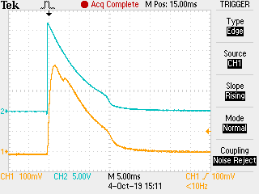
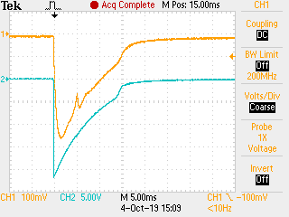

# Latching Solenoid

## Overview

A current pulse is used to cause an attraction or repulsion [Lorentz] force to operate a [bistable] device.

[Lorentz]: https://en.wikipedia.org/wiki/Lorentz_force#Force_on_a_current-carrying_wire
[bistable]: https://en.wikipedia.org/wiki/Bistability

## Orbit 58874N Extra Valve

I want to thank Martin, who opened an Orbit 56082 to look at what it was doing to operate a solenoid; his goal is to replicate that with an [Orbit 58874N Extra Valve] controlled from an R-Pi Zero. 

[Orbit 58874N Extra Valve]: https://www.amazon.com/gp/product/B003LY4I2I

First, the boost converter charges a 2200uF capacitor from about 3V to about 22V. The boost has to be done so that it does not disrupt the MCU voltage too much. Also, the boost needs to be blocked (PMOS) after discharging so that the solenoid itself (a low resistance path) does not disrupt the MCU supply.

Once boosting is done, the charge is applied to do a set operation on a solenoid, which is about 4.1 Ohm (inductance is unknown). Ch1 is showing current at 100mV/A.

After the irrigation cycle boosting is again done, and the charge is applied to do a reset operation on the solenoid. Ch1 is showing current at 100mV/A again.

This solenoid is demanding; it has a substantial direct-acting actuator. The current pulse has to end quickly, or the windings will smoke. Most other valves have a pilot valve that takes much less current and can survive continuous voltage. What most people need is a driver that is beginner-friendly. My [K3] and [Irrigate7] boards operate these solenoids, but they are not beginner-friendly. I need to add a short circuit test that can prevent the operation of a shorted solenoid, which is when I can damag the driver (H bridge).  

[K3]: https://github.com/epccs/Driver/tree/master/K3
[Irrigate7]: https://github.com/epccs/Irrigate7