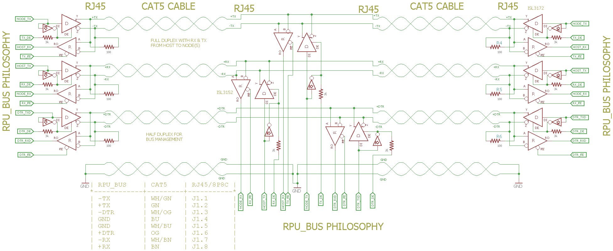
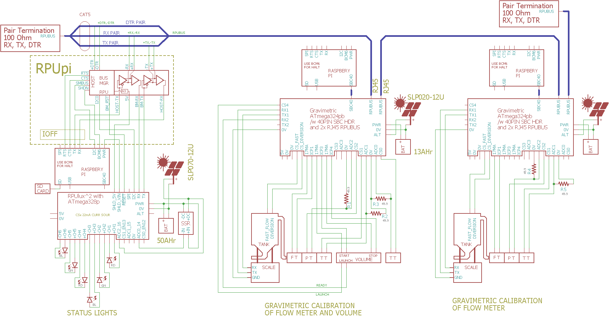
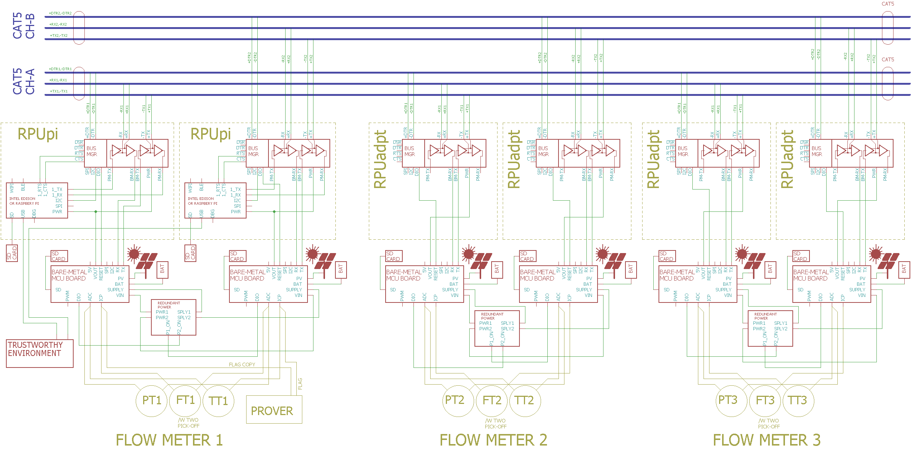

# Remote Programmable Unit Bus

## Overview

Remote, in this case, means the device is not at my desk or near a USB port, perhaps it is in an enclosure outside in the rain. Programmable means firmware uploading, which is the task of loading a bin/elf or hex image into the device's memory. Remote programming is aided by the use of a serial bootloader like [optiboot] and [xboot] on AVR devices (ARM targets may have ROM or user bootloaders). 

[optiboot]: https://github.com/Optiboot/optiboot
[xboot]:https://github.com/alexforencich/xboot

Developing firmware for an embedded device requires a toolchain. For AVR I use the cross compiler packages gcc-avr, binutils-avr, avr-libc, avrdude found in Debian, they are also ported to R-Pi and Ubuntu. These AVR tools are well known and work. Using avrdude to upload the compiled firmware image to an AVR is a method that I use with excellent results. Of particular interest are serial bootloaders used with avrdude's programmer type "-c" option, e.g., for optiboot (-c arduino ) or xboot (-c avr109). 

The first rule of embedded system development is to set up a way to do updates. Since my data acquisition and control project was going to be in the garden, I wanted to leverage these AVR tools but also wanted to place my development computer (with the cross compiler) far away from the action. The goal was to be able to push firmware updates without disassembling the enclosure and use the same communication channel for telemetry. The updates needed to be sent to the remote device, but also use a media with limited access for security. The RPUbus evolved out of those needs; it uses RS485 transceivers on three pairs: RX, TX, and has an out of band pair that started as DTR (which was used to start the bootloader). RX/TX is full duplex.


## [Wires]

[Wires]: ./Documents/RPU_BUS.pdf



```
            | RPU_BUS | CAT5    | RPU-ADPT |
            *---------+---------+----------*
            | +TX     | WH/GN   | J1.1     |
            | -TX     | GN      | J1.2     |
            | +DTR    | WH/OG   | J1.3     |
            | GND     | BU      | J1.4     |
            | GND     | WH/BU   | J1.5     |
            | -DTR    | OG      | J1.6     |
            | +RX     | WH/BN   | J1.7     |
            | -RX     | BN      | J1.8     |
```

As the design evolved the DTR pair become a half-duplex out of band bus management system.


## Application


It should be possible to run MODBUS over the RPU_BUS, textual directions, or just about anything. I like descriptive textual commands (Address 1 followed by request). 

```
/1/id?
{"id":{"name":"Adc","desc":"RPUno (14140^9) Board /w atmega328p","avr-gcc":"5.4.0"}}
/1/analog? 0,1,2,3
{"ADC0":"1.38","ADC1":"2.83","ADC2":"0.72","ADC3":"0.61"}
```


## Multidrop

It is possible to have more than one bare-metal control board on the bus. Any connected SBC computer can use its serial hardware port to communicate on the RPUbus exclusively. The control board has an I2C interface with the bus manager while the SBC has an SMBus interface to change how its local manager is configured. Note SMBus uses I2C hardware but does not use repeated starts or clock stretching (both of which cause problems for the OS).




## Fail-Safe bias

The transceivers have a built-in fail-safe bias, which is a little complicated to explain, but it makes an undriven bus (e.g., the failed condition) a defined HIGH state. If I turn off all the transceiver's drivers the bus is guaranteed to be in a defined state (the fail-safe state). With that known, the transceivers have been set up to turn off the driver while the UART outputs a TRUE (e.g., its default). That further means the driver will automatically drive the bus only when data is sent, so nothing needs to be done in software to turn off the bus (except to not talk, which can be a challenge). The bus manager is hardware interfaced to enable or disable the transceiver's receiver and driver. Firmware can be written and loaded by anyone wishing to do so. Keep in mind that a HIGH on the driver input will always override its enable and thus turn off the driver. None of the bus driver(s) can pull the bus into a driven HIGH state while others send it LOW (software error?). Prevention of cross-conduction between the differential drivers is another safety feature that allows me to have and find software errors without having to replace damaged parts.


## Bare-Metal

When a program is run without an operating system it is said to be bare-metal, such a program can start fast and have access to all the hardware registers that control the machine's peripherals. Bare-Metal is a low power option when hardware needs to be put in a controlled state as power is applied or requires precision timing beyond what is possible from an operating system. Microsoft DOS was more or less a bare-metal system since the software was able to write to the machine IO addresses directly to control the hardware registers, e.g., without having to use a device driver. I remember moving to NT and finding that nothing worked, a device driver was required. Modern operating systems run kernels that are essentially bare-metal programs that control the memory management hardware which enables isolating applications from accessing anything outside a confined memory space.

The memory protection system of modern operating systems is mostly taken for granted, but it plays a crucial role in how trustworthy the computing environment is. When calculations and transactions need to be trusted an operating system with a secure memory management model needs to be used in addition to well-known (verified or trustworthy) device drivers. Most of the time it would be too complicated and costly to maintain device drivers for the multitude of ways (often incompatible) that data acquisition hardware can be configured, and frankly uncommon device drivers erode trust. 

Bare-metal computing fills the gap between a trustworthy computing environment and the need to access and control hardware directly while also allowing improved timing constraints and startup time. However, bare-metal is not itself trustworthy; it just pushes the less dependable parts outside the secure environment.

The connection between a bare-metal device and the trustworthy environment needs to have controlled access (no network footprint) and be dependable (e.g., physical wires ran in a conduit, not a radio). 

One of the areas in which I have an interest is flow measurement for which I think the calculations (often done in a flow computer) should probably be done in a way that can be checked later, in other words verifiably [trustworthy]. To that end, the raw captured flow data from a bare-metal control board that is used for flow calculations (e.g., pulse times, flow temperature, flow pressure, Prover calibration, and so on) should be logged on the control board (e.g., SD card) to provide a verification source for the calculated flow. The raw data could also be compared with its redundant partner, in part to find data corruption. The flow calculations can then be made, checked, and even compared in a trusted computing environment (e.g. a Linux SBC with a trusted OS, perhaps itself redundant).

[trustworthy]: https://web.archive.org/web/20190322121858/http://mcwg.org/mcg-mirror/trustdef.htm


## Redundancy

Redundancy does more than improve uptime; it also provides a way to check that sensors are working (producing duplicate data), and thus adds to the integrity of the system. The idea shown has three flow meters that are measured with solar powered MCU boards. Each is battery backed and can provide its power status. There is redundant communication to each flow meter, but it is isolated to a separate group of devices should one of the serial bus links be damaged. Finally, local data logs on SD cards provide a way for checking and recovering data. 



A difficult problem to deal with for a high availability system is CMOS [latch-up]. A simple reset will not clear the condition; it requires removing power from the device. Since it may be challenging to identify which CMOS device has the state, it is often best to power down one-sided of the redundant system. CMOS devices are designed so that latch-up is generally not destructive. Proper power supply bypassing, and shielding can make it a rare condition that is caused by ionizing radiation sources like cosmic rays. A simple MCU like an ATmega328 may operate over its lifetime without experiencing a latch-up. My understanding is that the rate of occurrence of latch-up is related to the die area, the number of parasitic thyristor elements on the silicon die, and the radiation flux. More complex MCU are more likely to experience latch-up during their operating life.

[latch-up]: https://en.wikipedia.org/wiki/Latch-up
