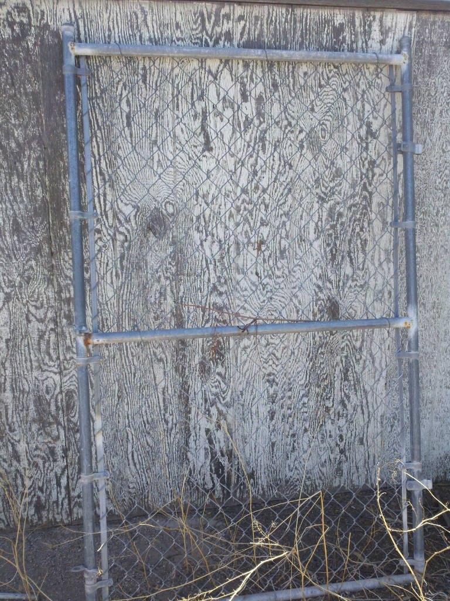
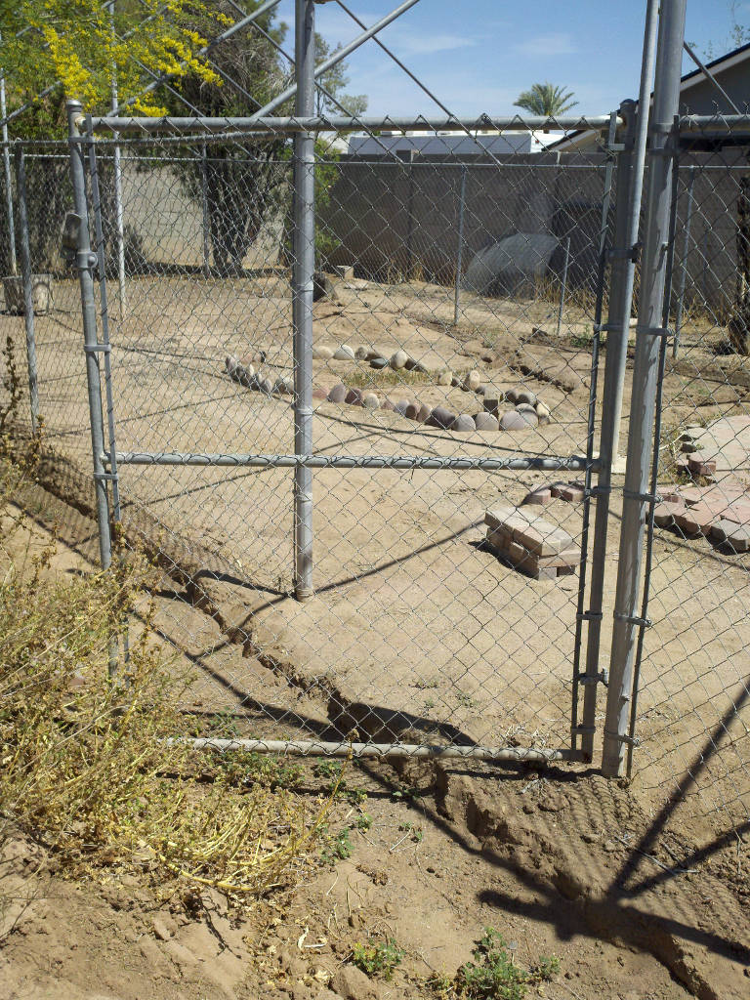
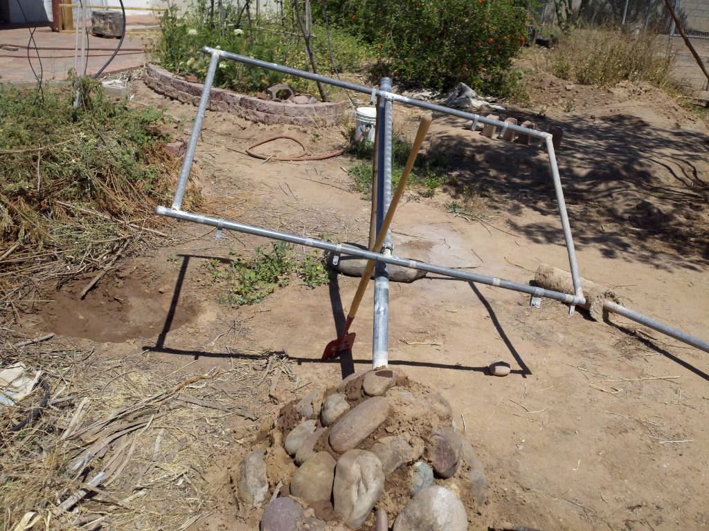
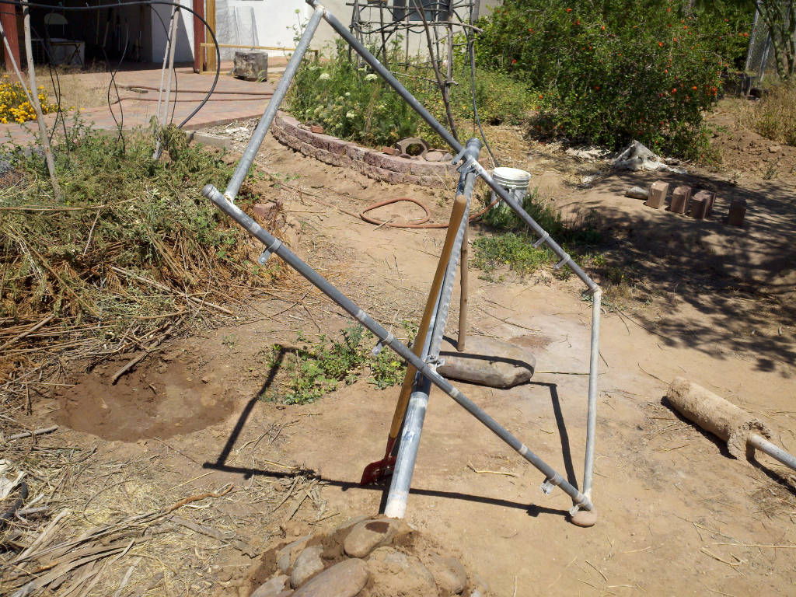
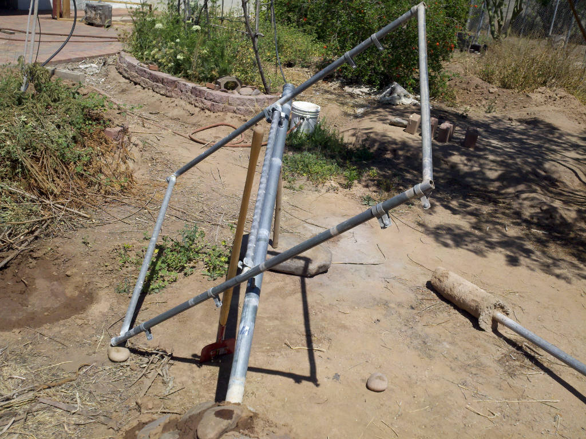
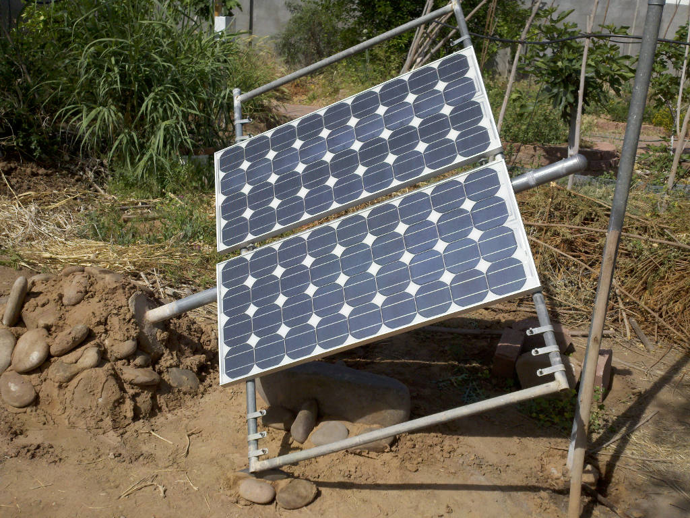

# Solar Track Rack

## Overview

Making a solar track rack from a repurposed gate. The idea is to move the solar panel to point at the sun through the day.

## Repurposed Gate

The gate is not in use.

To get the idea here is one that is larger, and not yet taken down.

After digging up the concrete clump at the end of the gate post, I arranged it to an angle I eyeballed (Early April) and made liberal use of the on-site adobe. Next, I moved the mounts to the center so the gate would rotate on that axis. This image shows how it ended up looking.

In the morning it can track to the east.

In the evening it can track to the west.

I have two SP75 panels that are nearly 20 years old. I used them for a few random experiments. This image shows the best mount I have ever done for them, and it was all junk I was nearly ready to throw out. 

